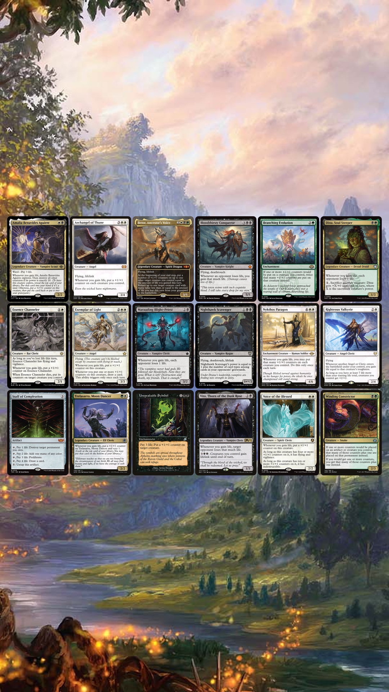
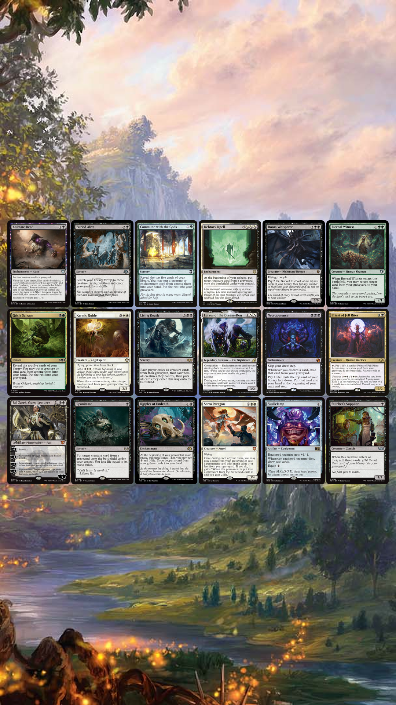
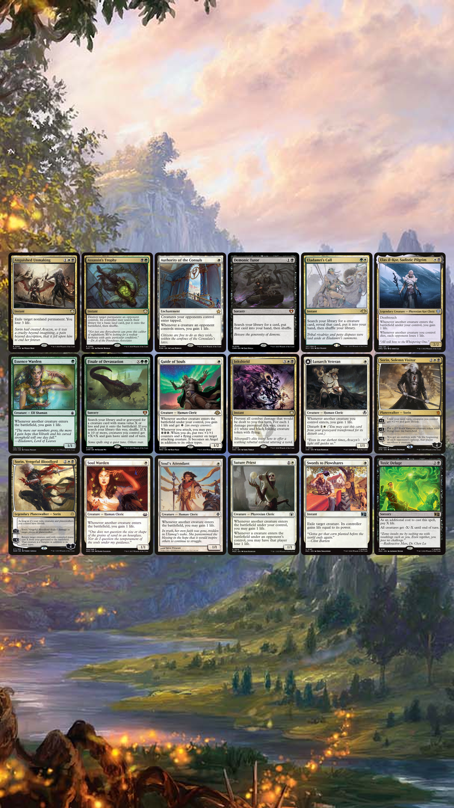
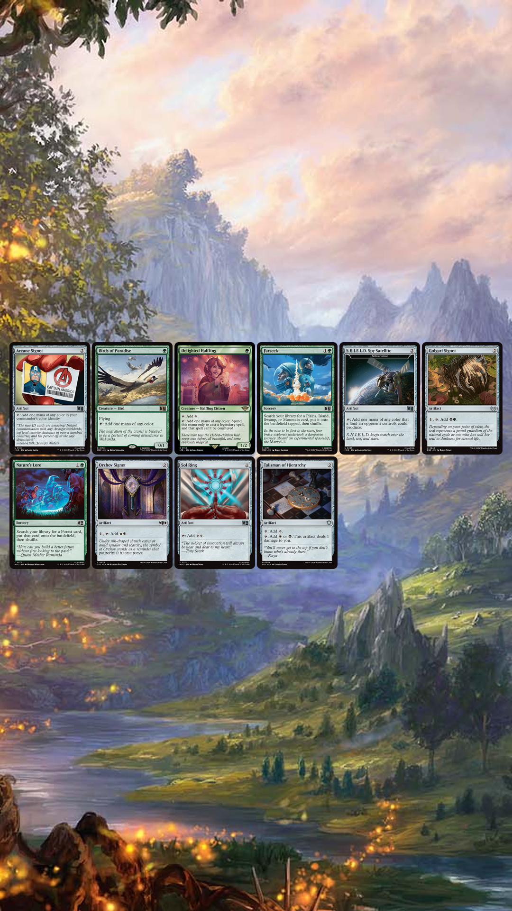
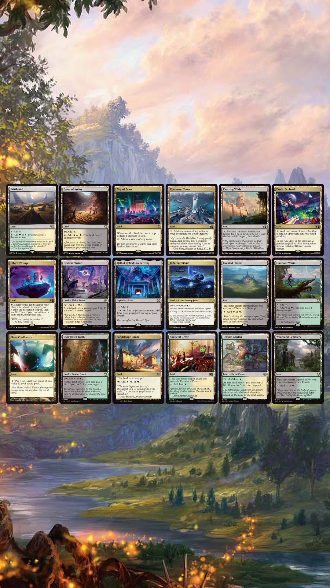
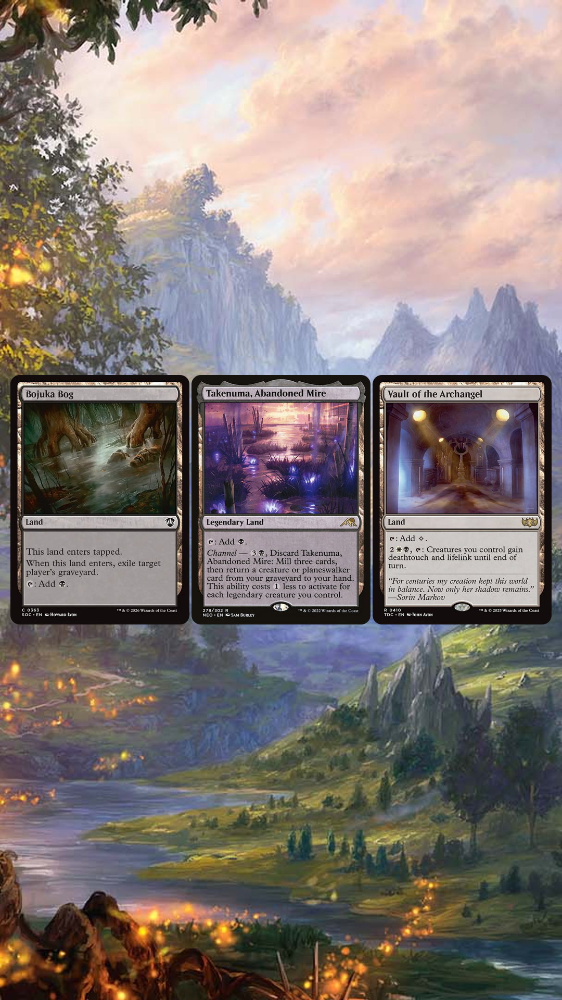

# 🖤🤍💚 Betor V2 — Lifegain, Blood, and the Grave

Gain life, grow threats, bring creatures back, and make dying everyone else’s problem.

This is my **Betor, Ancestor's Voice V2** Commander deck. It is an Abzan lifegain deck built around repeated life triggers, creature growth, drain effects, self-mill, and recursion.

This version leans harder into the graveyard than the first build. It still has the huge lifegain-counter finishers, but now it also has more ways to fill the graveyard, bring back key creatures, and turn one good setup turn into a table-ending problem.

---

## 🐉 Commander

```txt
1 Betor, Ancestor's Voice
```

**Betor, Ancestor's Voice** turns life gain and life loss into pressure.

The deck wants to gain life often, use life as a resource, grow dangerous creatures with counters, and bring important creatures back from the graveyard. Once Betor is active, the graveyard becomes part of the engine instead of just a place where dead cards sit.

---

## 📦 Download

* [Download Decklist TXT](betor-v2.txt)

---

## 👀 Quick Glance Decklist

### Commander

```txt
1 Betor, Ancestor's Voice
```

### Lifegain, Drain, and Payoff Core

```txt
1 Bloodthirsty Conqueror
1 Dina, Soul Steeper
1 Marauding Blight-Priest
1 Vito, Thorn of the Dusk Rose
1 Archangel of Thune
1 Nykthos Paragon
1 Voice of the Blessed
1 Exemplar of Light
1 Righteous Valkyrie
1 Essence Channeler
1 Nighthawk Scavenger
1 Amalia Benavides Aguirre
1 Trelasarra, Moon Dancer
1 Winding Constrictor
1 Branching Evolution
1 Unspeakable Symbol
1 Staff of Compleation
```

### Graveyard, Draw, and Recursion

```txt
1 Stitcher's Supplier
1 Commune with the Gods
1 Grisly Salvage
1 Buried Alive
1 Skullclamp
1 Necropotence
1 Doom Whisperer
1 Ripples of Undeath
1 Ral Zarek, Guest Lecturer
1 Lurrus of the Dream-Den
1 Eternal Witness
1 Priest of Fell Rites
1 Serra Paragon
1 Karmic Guide
1 Animate Dead
1 Reanimate
1 Debtors' Knell
1 Living Death
```

### Lifegain Starters, Removal, Protection, and Tutors

```txt
1 Soul Warden
1 Soul's Attendant
1 Essence Warden
1 Suture Priest
1 Lunarch Veteran
1 Guide of Souls
1 Elas il-Kor, Sadistic Pilgrim
1 Authority of the Consuls
1 Sorin, Vengeful Bloodlord
1 Sorin, Solemn Visitor
1 Inkshield
1 Toxic Deluge
1 Swords to Plowshares
1 Anguished Unmaking
1 Assassin's Trophy
1 Finale of Devastation
1 Demonic Tutor
1 Eladamri's Call
```

### Ramp and Mana

```txt
1 Sol Ring
1 Arcane Signet
1 Fellwar Stone
1 Talisman of Hierarchy
1 Orzhov Signet
1 Golgari Signet
1 Birds of Paradise
1 Delighted Halfling
1 Nature's Lore
1 Farseek
```

### Nonbasic Lands

```txt
1 Command Tower
1 Indatha Triome
1 Temple Garden
1 Godless Shrine
1 Overgrown Tomb
1 Sunpetal Grove
1 Isolated Chapel
1 Woodland Cemetery
1 Brushland
1 Caves of Koilos
1 Llanowar Wastes
1 Mana Confluence
1 City of Brass
1 Exotic Orchard
1 Fabled Passage
1 Evolving Wilds
1 Hall of Heliod's Generosity
1 Takenuma, Abandoned Mire
1 Vault of the Archangel
1 Sandsteppe Citadel
1 Bojuka Bog
```

### Basic Lands

```txt
6 Forest
5 Swamp
4 Plains
```

---

## 🖼️ Visual Deck Sheets

These images show the deck in readable groups. The strongest cards and main engine pieces come first, while lands stay together at the bottom.

### Sheet 1 — Blood and Ascension

Betor, combo pieces, lifegain payoffs, counter engines, and the biggest board-growth threats.



### Sheet 2 — Graveyard Teeth

Self-mill, draw, recursion, reanimation, and graveyard engines.



### Sheet 3 — Mercy Is a Weapon

Lifegain starters, removal, tutors, Sorins, and protection.



### Sheet 4 — Relics, Rings, and Rotten Light

Mana rocks, ramp, and early fixing.



### Sheet 5 — The Roads to the Grave

The main nonbasic land package.



### Sheet 6 — Last Gates

Utility lands that still matter late.



---

## 🧬 Deck Vibe

Betor V2 is not just a lifegain pile.

The deck starts with small life triggers from cards like **Soul Warden**, **Soul's Attendant**, **Essence Warden**, and **Lunarch Veteran**. Those small triggers help the deck survive early, but they also feed the real threats: counters, drain effects, lifelink swings, and graveyard recursion.

The deck can play a slower value game, but it also has explosive turns where one lifegain trigger starts a chain that kills the whole table.

---

## ✨ Main Things the Deck Does

* Gains life repeatedly from creatures entering and lifelink damage
* Turns lifegain into +1/+1 counters
* Drains opponents when life is gained
* Uses life total as a resource
* Self-mills to fill the graveyard
* Reanimates important creatures
* Rebuilds after removal
* Can kill through combat, drain, recursion, or combo lines

---

## 🩸 Cards to Watch

Some of the scariest cards in the deck include:

* **Betor, Ancestor's Voice**
* **Bloodthirsty Conqueror**
* **Dina, Soul Steeper**
* **Marauding Blight-Priest**
* **Vito, Thorn of the Dusk Rose**
* **Archangel of Thune**
* **Nykthos Paragon**
* **Voice of the Blessed**
* **Unspeakable Symbol**
* **Staff of Compleation**
* **Necropotence**
* **Doom Whisperer**
* **Ripples of Undeath**
* **Living Death**
* **Inkshield**
* **Finale of Devastation**
* **Debtors' Knell**

---

## 🗂️ Downloads & Extras

| File            | What It Is                                         | Download                                     |
| --------------- | -------------------------------------------------- | -------------------------------------------- |
| Decklist        | Copy/paste decklist for imports or quick editing   | [Download TXT](betor-v2.txt)                 |
| Sheet 1         | Betor, combo pieces, and lifegain payoffs          | [Download Image](images/BetorV2Render1.png)  |
| Sheet 2         | Graveyard, draw, and recursion engines             | [Download Image](images/BetorV2Render2.png)  |
| Sheet 3         | Lifegain starters, removal, tutors, and protection | [Download Image](images/BetorV2Render3.png)  |
| Sheet 4         | Ramp and mana                                      | [Download Image](images/BetorV2Render4.png)  |
| Sheet 5         | Main nonbasic lands                                | [Download Image](images/BetorV2Render5.png)  |
| Sheet 6         | Utility lands                                      | [Download Image](images/BetorV2Render6.png)  |
| Deck Background | Background / inspiration image for the deck        | [Download Image](images/Eldraine1.jpg) |

---

## 📝 Notes

This deck may change over time as cards get tested, cut, upgraded, resurrected, judged unfair, or returned to the pile because they looked cool.

Betor V2 can win fairly through combat, but it can also win suddenly through drain loops and graveyard recursion. The deck gets more dangerous the longer the game goes, especially once Betor, recursion, and self-mill are online.

Newest files in this folder are the current version.

---

# 🧪 Combo Lines and Synergies to Look For

This section explains the main lines in the deck. Some are full win conditions. Others are value engines that help the deck build toward a win.

---

## 🩸 Bloodthirsty Conqueror + Dina, Soul Steeper

```txt
Bloodthirsty Conqueror
+ Dina, Soul Steeper
+ any lifegain trigger
= table-kill loop
```

This is one of the strongest win lines in the deck.

Once you gain life, **Dina, Soul Steeper** makes each opponent lose 1 life. **Bloodthirsty Conqueror** sees opponents losing life and gains you that much life. That new lifegain triggers Dina again, and the loop continues.

This line can kill the whole table once it starts.

---

## 🩸 Bloodthirsty Conqueror + Marauding Blight-Priest

```txt
Bloodthirsty Conqueror
+ Marauding Blight-Priest
+ any lifegain trigger
= table-kill loop
```

This works similarly to the Dina line.

When you gain life, **Marauding Blight-Priest** makes each opponent lose 1 life. **Bloodthirsty Conqueror** turns that life loss into more lifegain for you, which triggers Marauding Blight-Priest again.

This gives the deck a second version of the same table-ending engine.

---

## 🦇 Bloodthirsty Conqueror + Vito

```txt
Bloodthirsty Conqueror
+ Vito, Thorn of the Dusk Rose
+ lifegain
= one opponent can die very quickly
```

This line is usually better at killing one player than the whole table.

When you gain life, **Vito** makes target opponent lose that much life. **Bloodthirsty Conqueror** gains you life when that opponent loses life, which can keep the chain going.

This is one of the deck’s nastiest single-player kill lines.

---

## ✨ Archangel of Thune + Soul Sisters

```txt
Archangel of Thune
+ Soul Warden / Soul's Attendant / Essence Warden / Lunarch Veteran
= every lifegain trigger grows the board
```

This is one of the deck’s best non-infinite engines.

The soul sister creatures gain life whenever creatures enter. **Archangel of Thune** turns every lifegain trigger into a +1/+1 counter on each creature you control.

In multiplayer, this can grow out of control quickly because opponents are also playing creatures.

---

## 🌕 Nykthos Paragon + Big Lifegain

```txt
Nykthos Paragon
+ lifelink damage / Inkshield / Vault of the Archangel / Sorin lifelink
= massive counters across the board
```

**Nykthos Paragon** turns large lifegain events into huge board growth.

This matters a lot with lifelink damage, **Vault of the Archangel**, **Sorin, Solemn Visitor**, **Inkshield**, and big creatures that can gain a large amount of life at once.

One strong lifegain turn can turn the entire board into lethal attackers.

---

## 🧬 Betor + Life-Loss Tools

Betor cares about how much life you lost during the turn. This deck can use that on purpose.

Important life-loss tools include:

```txt
Necropotence
Doom Whisperer
Unspeakable Symbol
Staff of Compleation
Toxic Deluge
pain lands
```

These cards let you pay life for value while also setting up Betor’s end step reanimation.

Example:

```txt
Pay life with Doom Whisperer to surveil.
Put creatures into the graveyard.
At the end step, Betor can return a creature with mana value equal to or less than the life you lost.
```

This makes life loss part of the deck’s engine.

---

## 🪦 Stitcher’s Supplier + Recursion

```txt
Stitcher's Supplier
+ Lurrus / Betor / Reanimate / Living Death
= early self-mill and repeat graveyard value
```

**Stitcher’s Supplier** helps fill the graveyard early. It mills when it enters and mills again when it dies.

That is useful because the deck has many ways to use the graveyard:

```txt
Lurrus of the Dream-Den
Betor, Ancestor's Voice
Reanimate
Animate Dead
Living Death
Debtors' Knell
Karmic Guide
Serra Paragon
```

This card is small, but it helps the deck reach its stronger graveyard lines faster.

---

## 🌿 Commune with the Gods / Grisly Salvage / Ripples of Undeath

These cards help the deck find important pieces while also filling the graveyard.

Good cards to find or mill include:

```txt
Bloodthirsty Conqueror
Karmic Guide
Archangel of Thune
Doom Whisperer
Lurrus of the Dream-Den
Dina, Soul Steeper
Vito, Thorn of the Dusk Rose
Marauding Blight-Priest
Animate Dead
Debtors' Knell
Living Death
```

This deck does not mind putting strong creatures into the graveyard. Many of them can be brought back later by Betor or another recursion spell.

---

## 🕯️ Betor + Karmic Guide

```txt
Betor returns Karmic Guide.
Karmic Guide returns another creature.
```

This is one of the strongest graveyard lines in the deck.

**Betor** can return **Karmic Guide** at the end step. Then **Karmic Guide** can return another creature from the graveyard.

A dangerous line is:

```txt
Betor returns Karmic Guide.
Karmic Guide returns Bloodthirsty Conqueror.
Dina or Marauding Blight-Priest is already on the battlefield.
Any lifegain trigger can start the loop.
```

This is why self-mill matters so much in this version of the deck.

---

## ☠️ Living Death

**Living Death** is one of the deck’s biggest comeback cards.

It can work as:

```txt
a board wipe
a mass reanimation spell
a combo setup card
a punishment for removing your creatures
```

After enough self-mill, **Living Death** can completely change the game. Opponents lose their boards, your graveyard comes back, and the deck can rebuild into lifegain triggers, drain pieces, and combo threats all at once.

---

## 🛡️ Inkshield

**Inkshield** is both protection and a finisher.

It can stop a lethal attack, prevent the damage, and create a large number of Inkling tokens. Those tokens can then feed the deck’s lifegain and counter engines.

Inkshield is especially dangerous with:

```txt
Soul Warden effects
Dina, Soul Steeper
Marauding Blight-Priest
Bloodthirsty Conqueror
Nykthos Paragon
Archangel of Thune
```

A huge attack into Inkshield can turn into a huge board for you instead.

---
