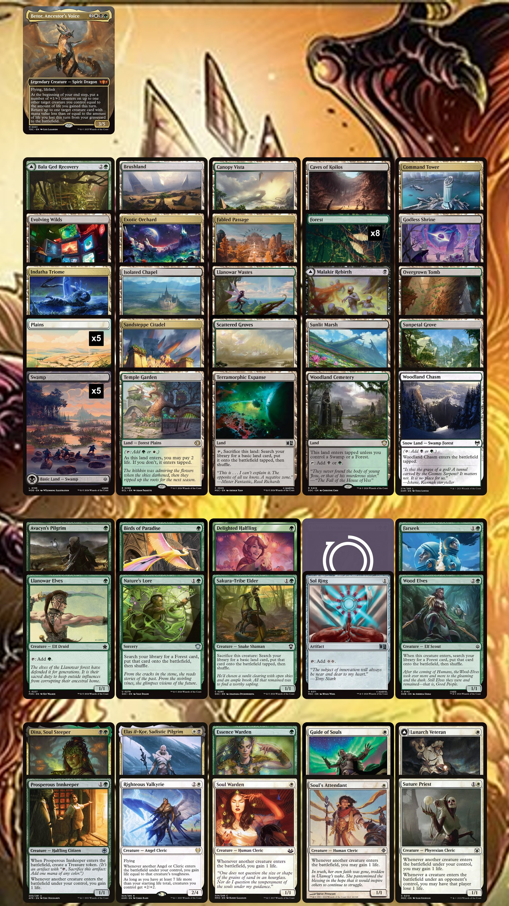
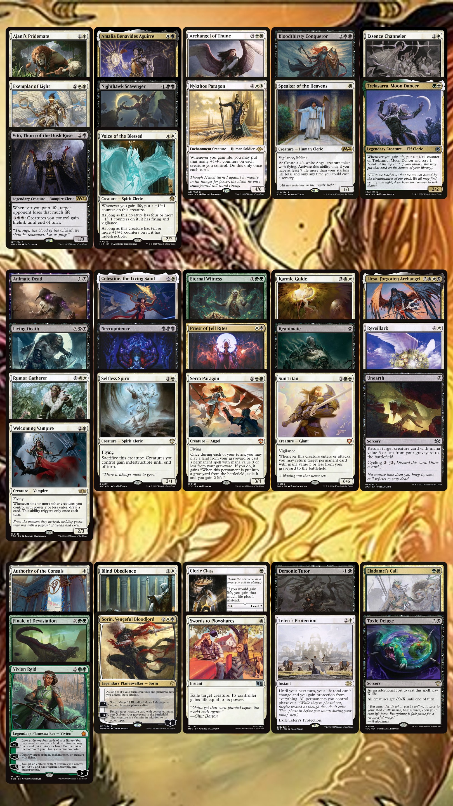

# 🖤 Betor Lifegain

Gain life, grow threats, bring creatures back, and make dying everyone else’s problem.

This is my Betor, Ancestor's Voice Commander deck. It is built around lifegain triggers, creature growth, drain effects, recursion, and value engines that make the deck harder to kill the longer the game goes.

---

## 🐉 Commander

**Betor, Ancestor's Voice**

The deck wants to gain life often, build a scary board, and use lifegain payoffs to turn small triggers into real pressure.

---

## 📦 Download

* [Download Decklist TXT](betor-lifegain.txt)

---

## 🧬 Deck Vibe

This deck is about stacking small life triggers until they become a problem.

It can gain life from creatures entering, drain opponents, grow creatures with counters, bring important creatures back from the graveyard, and turn the game into a slow haunted staircase where everyone else keeps losing life and wondering when this became their problem.

---

## ✨ Main Things the Deck Does

* Gains life repeatedly
* Grows creatures with lifegain payoffs
* Drains opponents
* Brings creatures back from the graveyard
* Uses recursion to keep threats coming back
* Can win through combat, drain effects, or big finishers

---

## 🩸 Cards to Watch

Some of the scarier cards in the deck include:

* **Archangel of Thune**
* **Vito, Thorn of the Dusk Rose**
* **Bloodthirsty Conqueror**
* **Nykthos Paragon**
* **Voice of the Blessed**
* **Living Death**
* **Finale of Devastation**
* **Necropotence**
* **Teferi's Protection**

---

## 👀 Quick Glance Decklist

### Commander

```txt
1 Betor, Ancestor's Voice
```

### Lands

```txt
1 Command Tower
1 Sandsteppe Citadel
1 Indatha Triome
1 Temple Garden
1 Godless Shrine
1 Overgrown Tomb
1 Canopy Vista
1 Scattered Groves
1 Woodland Chasm
1 Sunlit Marsh
1 Sunpetal Grove
1 Isolated Chapel
1 Woodland Cemetery
1 Brushland
1 Caves of Koilos
1 Llanowar Wastes
1 Exotic Orchard
1 Fabled Passage
1 Evolving Wilds
1 Terramorphic Expanse
1 Bala Ged Recovery
1 Malakir Rebirth
8 Forest
5 Plains
5 Swamp
```

### Ramp

```txt
1 Sol Ring
1 Llanowar Elves
1 Elvish Mystic
1 Birds of Paradise
1 Avacyn's Pilgrim
1 Delighted Halfling
1 Sakura-Tribe Elder
1 Wood Elves
1 Nature's Lore
1 Farseek
```

### Lifegain Engines

```txt
1 Soul Warden
1 Soul's Attendant
1 Essence Warden
1 Suture Priest
1 Lunarch Veteran
1 Prosperous Innkeeper
1 Guide of Souls
1 Elas il-Kor, Sadistic Pilgrim
1 Dina, Soul Steeper
1 Righteous Valkyrie
```

### Lifegain Payoffs

```txt
1 Ajani's Pridemate
1 Essence Channeler
1 Nighthawk Scavenger
1 Amalia Benavides Aguirre
1 Trelasarra, Moon Dancer
1 Voice of the Blessed
1 Exemplar of Light
1 Vito, Thorn of the Dusk Rose
1 Speaker of the Heavens
1 Archangel of Thune
1 Nykthos Paragon
1 Bloodthirsty Conqueror
```

### Draw and Value

```txt
1 Welcoming Vampire
1 Rumor Gatherer
1 Necropotence
```

### Protection

```txt
1 Selfless Spirit
1 Teferi's Protection
```

### Recursion

```txt
1 Eternal Witness
1 Priest of Fell Rites
1 Serra Paragon
1 Karmic Guide
1 Reveillark
1 Sun Titan
1 Liesa, Forgotten Archangel
1 Celestine, the Living Saint
1 Animate Dead
1 Reanimate
1 Unearth
1 Living Death
```

### Planeswalkers

```txt
1 Sorin, Vengeful Bloodlord
1 Vivien Reid
```

### Control and Removal

```txt
1 Authority of the Consuls
1 Blind Obedience
1 Toxic Deluge
1 Swords to Plowshares
```

### Tutors and Finishers

```txt
1 Demonic Tutor
1 Eladamri's Call
1 Finale of Devastation
```

### Class

```txt
1 Cleric Class
```

---

## 🖼️ Visual Deck Sheets

Every 100-card deck in **The Spellbook Files** will usually have **two visual images** so the cards are easier to see instead of being crammed into one giant tiny poster.

### Image 1 — Lands, Ramp, and Lifegain Core



### Image 2 — Payoffs, Value, Recursion, and Interaction



---

## 📝 Notes

This deck may change over time as cards get tested, cut, upgraded, resurrected, judged unfair, or returned to the pile because they looked cool.

Newest files in this folder are the current version.

---

## 🗂️ Downloads & Extras

| File | What It Is | Download |
|---|---|---|
| Decklist | Copy/paste decklist for imports or quick editing | [Download TXT](betor-lifegain.txt) |
| Visual Sheet 1 | Lands, ramp, and lifegain core | [Download Image](betor-lands-ramp.jpeg) |
| Visual Sheet 2 | Payoffs, value, recursion, and interaction | [Download Image](Betor-payoffs-value-interaction.jpeg) |
| Deck Background | Background / inspiration image for the deck | [Download Image](BetorBackground.jpg) | 
