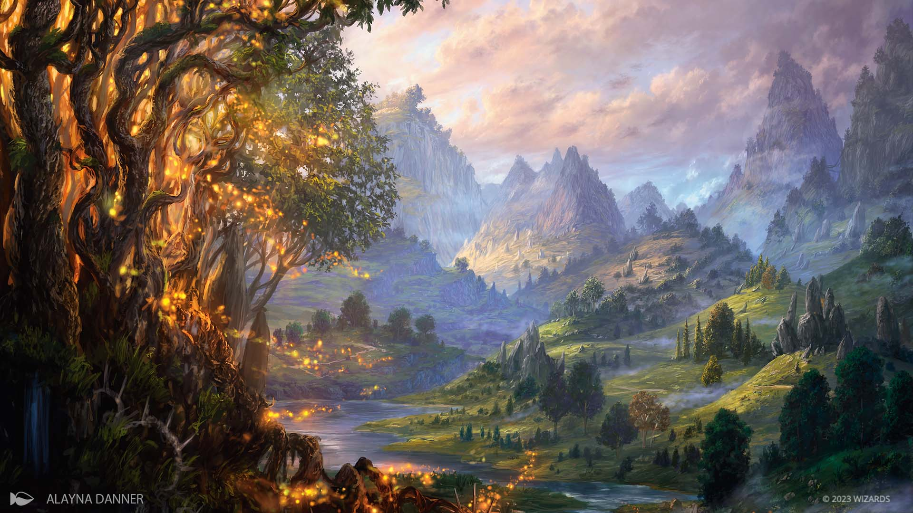
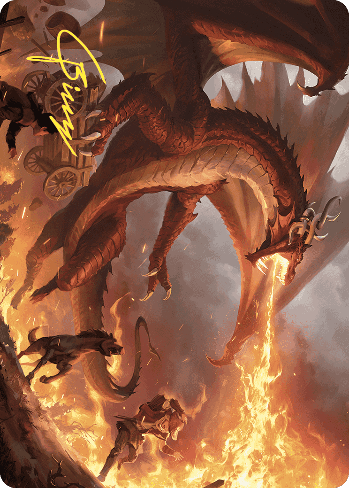
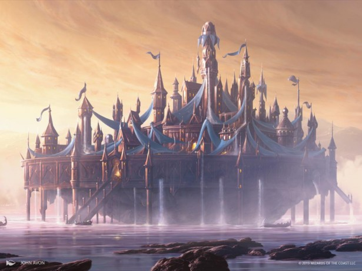
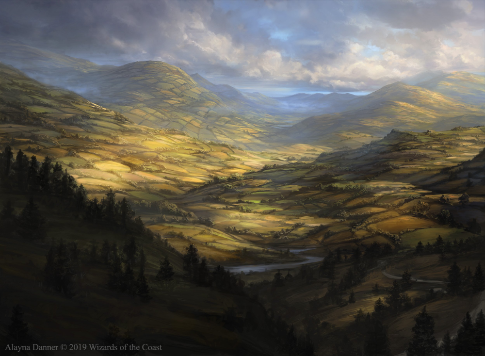
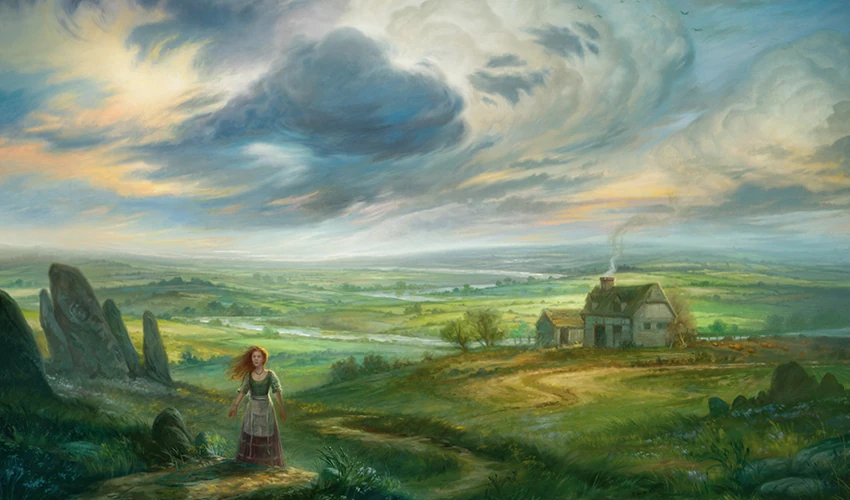
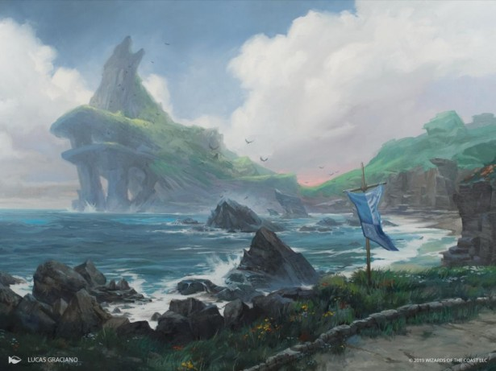
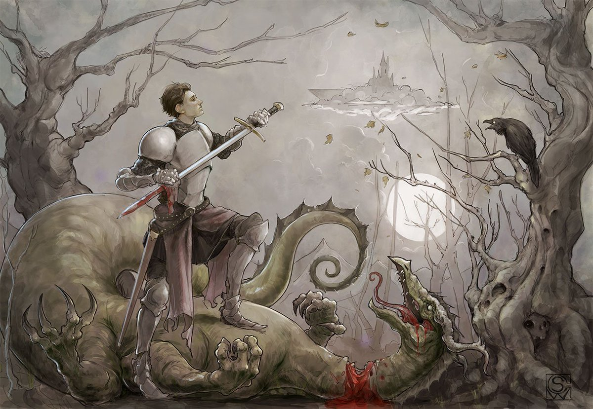
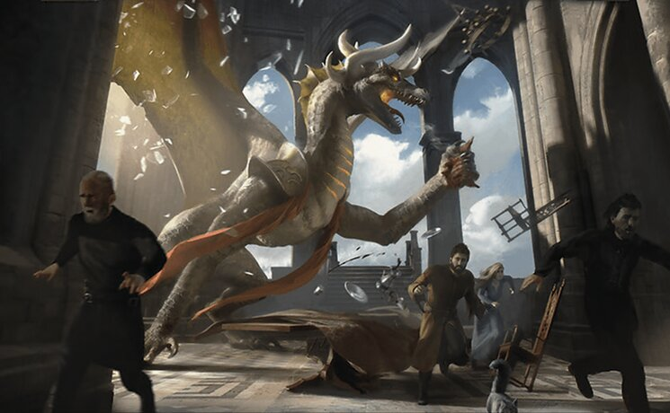

# 🐉 Korvold’s Cursed Banquet

  <em>A king crowned in scale and famine.</em> 
  <strong>Nothing is wasted. Everything is tribute.</strong>

---

  

  <em>The fae-cursed lands of Eldraine, where beauty lingers too long and every road seems to remember a bargain.</em>

---

## 🕯️ The Cursed Wedding

In the fae-cursed lands of Eldraine, there reigns a king crowned in scale and famine.

Not born of dragonblood.

Not blessed by flames of old.

Not some ancient wyrm risen from the first fires of the world, nor some noble beast destined by prophecy to wear the sky as its mantle.

No.

For nought was he meant to be.

He was not chosen by fate. He was not raised by glory. He was not carved from legend by hands greater than man.

He was made.

Made on a beautiful, flawless afternoon.

A day of celebration.

A wedding.

The halls were dressed in gold, and the gold glittered with the quiet patience of something waiting to be fed. Every goblet shone like an eye. Every gift waited like a trap. Every vow rang through the hall like silver over an empty grave.

And there, beneath the banners and the blessings, the fae looked upon a greedy king.

They saw the hunger hiding under his crown.

And they gave it claws.

---

## 👑 The King Revealed

The curse did not create Korvold.

It revealed him.

It stripped away the soft lie of a man and left the truth standing at the table — a crown with teeth, a throne with wings, a famine dressed in royal robes.

Almost a god.

Always a prisoner.

Wrought high enough to rule, but bound low enough to rot within the cage of his own wanting.

For the crown upon his head did not free him.

It fed him.

And the hunger it fed was never his servant.

It was his master.

---

  

  <em>The king was not found at all. Only Korvold remained.</em>

---

## 🍷 The First Offering

So the wedding feast became the first offering.

The tables split beneath him. The silver bent. The candles guttered low, not as if the wind had touched them, but as if even fire wished to bow its head and be forgotten.

The music faltered note by note.

Then the breathing of the guests.

Then even that was taken.

The king devoured the banquet.

He devoured the gifts.

He devoured the guests.

Not in rage.

Not in madness.

In ceremony.

For the curse had made a sacrament of appetite, and every scream became a hymn to the thing now seated where a man had been.

The bride’s veil was found among the ashes.

The ring was found beneath a claw.

The king was not found at all.

Only Korvold remained.

And when the hall at last fell silent, when the golden plates lay empty and the final cup rolled gently across the floor, the dragon looked upon the ruin of his wedding day and understood the first law of his new kingdom.

> **Nothing is wasted.**
> **Everything is tribute.**

The feast had ended.

The banquet had not.

---

## 🏰 The Law of the Banquet

For curses born of the fae do not die when their first joke is spent.

They linger.

They learn.

They crawl into custom, into law, into the soft mouths of those who survive long enough to explain why the horror must continue.

By dawn, the servants who had hidden beneath the stairwells came forth and found the dragon sleeping upon a hill of gifts and bones. None dared wake him. None dared flee him. The doors of the hall stood open, yet every road beyond them seemed suddenly longer than it had before.

So they cleaned.

They gathered the broken gold.

They lifted the crowns from the dead.

They swept the ash.

They carried away what could be carried.

And what could not be carried, they called holy.

Such is the way of frightened kingdoms.

By the second dawn, tribute had a schedule.

By the third, it had a name.

By the seventh, it had priests.

They said the king still ruled.

They said the dragon was a blessing misunderstood.

They said the feast had been necessary.

They said many things, for men will build language around a wound if it keeps them from looking into it.

But in the deep places of the castle, where the gold lay warm and the shadows smelled faintly of smoke, the truth remained simple.

Korvold was hungry.

And the kingdom had learned to feed him.

---

  

  <em>Castles still rose from mist and water, as if no shadow could ever reach them.</em>

---

## 💰 Gold Is Only the First Course

At first they brought treasure.

Coins in iron chests. Goblets wrapped in velvet. Rings stripped from cold hands. Tax wagons heavy enough to scar the roads beneath them. Relics from old chapels. Crowns from lesser houses. Dowries from daughters whose fathers hoped gold might buy mercy.

Korvold accepted them all.

Then he swallowed the chests.

Then he swallowed the hands that carried them.

And the court learned the second law of the banquet.

> **Gold is only the first course.**

So they brought cattle.

Then prisoners.

Then traitors.

Then those who had been called traitors only after the dragon stirred in his sleep.

The court grew clever in its cruelty. Every failure became an offering. Every debt became a body. Every servant learned to stand behind someone slower. Every noble learned to smile with one foot turned toward the door.

Still the banquet widened.

It did not stay within the hall.

It slipped into the villages like smoke beneath a door.

It sat at family tables.

It waited in market stalls.

It hid in the sound of coins changing hands.

A farmer paid in grain.

A thief paid in secrets.

A soldier paid in blood.

A child paid by being born beneath a roof that owed too much.

All roads led back to the dragon’s table.

All plenty became promise.

All promise became tribute.

And all tribute, in time, became Korvold.

---

## 🐲 Every Guest Is Welcome

There were those who believed they could profit from him.

There always are.

Goblins came with sacks of stolen coin and called themselves loyal. Devils came with contracts already bleeding at the edges. Assassins came with knives still wet from work done in the dark. Merchants came with ledgers full of names and a trembling hope that numbers might protect them from teeth.

Korvold welcomed them.

He welcomed everyone.

That was the old joke of the wedding, still laughing beneath the curse.

> **Every guest is welcome.**
> **Every guest is counted.**
> **Every guest is meat, should the table ask it.**

Yet the dragon was no mindless beast.

That would have been mercy.

A beast eats and sleeps and forgets the shape of what it has ruined.

Korvold remembered.

Somewhere beneath the scale, beneath the flame, beneath the royal hunger that wore him like armor, there remained the smallest ruin of a man.

Not enough to repent.

Not enough to stop.

Only enough to know.

He knew the fear in their eyes.

He knew the taste of their loyalty.

He knew that every offering made him larger and less himself.

He knew the cage was growing with him.

That was the third law of the banquet.

> **The more the king consumes, the less of the king remains.**

So he fed.

Because hunger commanded it.

He ruled.

Because the crown demanded it.

He sacrificed.

Because the curse had made sacrifice the only language his kingdom still understood.

---

  

  <em>The fields still bent beneath gold light. Beauty does not save a kingdom from hunger.</em>

---

## 🔥 The Banquet Still Breathes

A treasure cracked open beneath his claws, and he grew.

A servant fell beneath the shadow of his wings, and he grew.

A beast was led trembling to the table, and he grew.

A promise was broken.

A debt was paid.

A life was spent.

And each time, some unseen hand turned another page in the dark.

The people began to whisper that Korvold did not keep a treasury.

He kept a stomach with doors.

They whispered that the castle did not have a throne room.

It had a mouth.

They whispered that the banquet table was longer than it had been yesterday, and that no carpenter in the realm would admit to building the new chairs.

Still the invitations came.

Written in gold.

Sealed in wax.

Delivered by hands that refused to shake until after the message had been given.

To receive one was an honor.

That was what the court said.

To refuse one was treason.

That was what the guards said.

To accept one was death.

That was what everyone knew.

And high above it all, coiled among smoke-dark rafters and banners stiff with old blood, Korvold listened to the kingdom lie to itself and called the sound music.

For the feast had become more than punishment.

It had become rule.

It had become machine.

It had become the shape of a realm that could no longer tell the difference between worship and survival.

So let the halls be dressed again.

Let the gold be polished.

Let the goblets shine like watchful eyes.

Let the gifts be stacked beneath the banners.

Let the guests arrive in silk and trembling perfume.

Let them speak their vows.

Let them call it celebration.

Let them pretend the empty chair beside them is not waiting.

Korvold knows better.

The fae know better.

The table knows best of all.

For in the fae-cursed lands of Eldraine, beneath the shadow of a king crowned in scale and famine, the banquet still breathes.

The first course is gold.

The second is blood.

The final course is whoever thought they were invited.

---

  <strong>Nothing is wasted. Everything is tribute.</strong>

---

## 🖼️ The Lands Beneath the Banquet

Before the curse became law, Eldraine was still beautiful.

That is the cruelty of it.

These are the lands beneath the banquet — the roads, waters, fields, and towers that learned to live under the shadow of a hungry king.

  
  

  
  

  
  

  
  

  <em>Click any image to open it larger.</em>

---

  <a href="../README.md">⬅ Back to The Spellbook Files</a>

